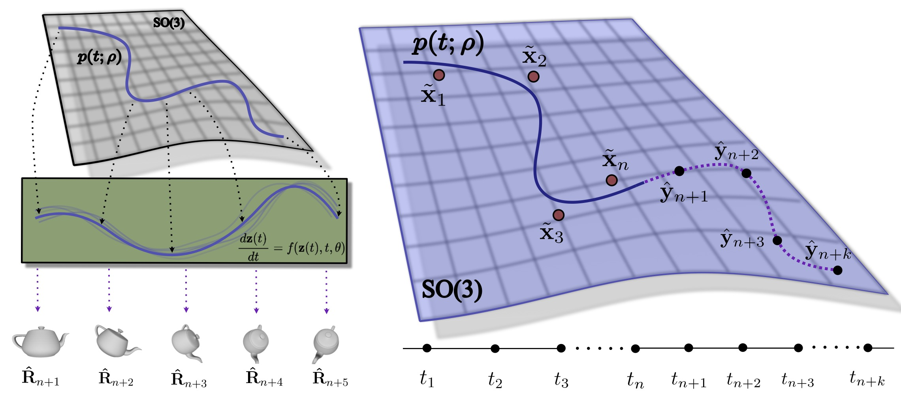

# Forecasting Continuous Non-Conservative Dynamical Systems in SO(3)

### Official implementation of the ICCV 2025 **Oral** Paper:

_Forecasting Continuous Non-Conservative Dynamical Systems in SO(3)_<br>
Lennart Bastian, Mohammad Rashed, Nassir Navab, and Tolga Birdal


[](https://arxiv.org/abs/2508.07775)
[](https://bastianlb.github.io/forecasting-rotational-dynamics/)
[](https://iccv.thecvf.com/Conferences/2025/AcceptedPapers)
[](LICENSE)

<div align="center">

</div>

## Abstract

Modeling the rotation of moving objects is a fundamental task in computer vision, yet SO(3) extrapolation still presents numerous challenges: (1) unknown quantities such as the moment of inertia complicate dynamics, (2) the presence of external forces and torques can lead to nonconservative kinematics, and (3) estimating evolving state trajectories under sparse, noisy observations requires robustness. We propose modeling trajectories of noisy pose estimates on the manifold of 3D rotations in a physically and geometrically meaningful way by leveraging Neural Controlled Differential Equations guided with SO(3) Savitzky-Golay paths. Existing extrapolation methods often rely on energy conservation or constant velocity assumptions, limiting their applicability in real-world scenarios involving non-conservative forces. In contrast, our approach is agnostic to energy and momentum conservation while being robust to input noise, making it applicable to complex, non-inertial systems. Our approach is easily integrated as a module in existing pipelines and generalizes well to trajectories with unknown physical parameters. By learning to approximate object dynamics from noisy states during training, our model attains robust extrapolation capabilities in simulation and various real-world settings.

## Quick Start

### 1. Installation

**NVIDIA GPU (recommended):**
```bash
pip install -r requirements.txt
```

**CPU only:**
```bash
pip install jax[cpu] && pip install -r requirements.txt --no-deps
pip install $(grep -v "^jax\[" requirements.txt)
```

### 2. Generate Training Data
```bash
python -m simulation.trajectory_gen --config-file simulation/configs/variable_uniform.yaml
```

### 3. Train SG-Neural CDE Model
```bash
cd jax_training && python train.py --config-file configs/so3_sg_neural_cde.yaml
```

## Repository Structure

```
├── simulation/                    # Physics simulation framework
│   ├── so3_dynamics.py          # Rigid body dynamics equations
│   ├── so3_scenarios.py         # Physical scenarios (damped, magnetic, etc.)
│   ├── trajectory_gen.py        # Dataset generation script
│   └── configs/                 # Simulation configurations
├── jax_training/                 # JAX/Flax training pipeline  
│   ├── models/
│   │   ├── SO3NeuralCDE.py      # SG-Neural CDE implementation
│   │   └── GRU.py               # SO(3) GRU baseline
│   ├── utils/
│   │   └── savitzky_golay_so3.py # SO(3) Savitzky-Golay filter
│   ├── configs/                 # Model configurations
│   └── train.py                 # Main training script
├── data/                        # Generated training datasets
└── requirements.txt
```

## Experimental Scenarios

The repository includes five physical scenarios from our paper:

1. **Freely Rotating Body**: No external torques (τ_ext = 0)
2. **Linear Torque Control**: Linear control law τ_ext = J(Aω + b)  
3. **Velocity Damping**: Direct damping τ_ext = J(Dω)
4. **Combined External Torque**: Damping + orientation-dependent external forces
5. **Variable Dynamics**: Mixed scenarios for generalization testing

## Model Configurations

Essential configurations for reproducing paper results:

- **`so3_sg_neural_cde.yaml`**: Main SG-Neural CDE model
- **`gru_rnn.yaml`**: SO(3) GRU baseline 
- **`so3_neural_cde.yaml`**: Standard Neural CDE baseline

## Usage Examples

### Basic Training
```bash
# Train on freely rotating bodies
cd jax_training
python train.py --config-file configs/so3_sg_neural_cde.yaml \
                --DATA.SCENARIO freely_rotating \
                --TRAIN.EPOCHS 100
```

### Evaluation
```bash
# Evaluate trained model
python train.py --config-file configs/so3_sg_neural_cde.yaml \
                --MODE eval \
                --MODEL.CHECKPOINT_PATH path/to/checkpoint.pkl
```

### Data Generation
```bash
# Generate custom training data
python -m simulation.trajectory_gen \
       --config-file simulation/configs/free_rotation.yaml \
       --OUTPUT.NUM_TRAJECTORIES 1000 \
       --OUTPUT.TRAJECTORY_LENGTH 10.0
```

## Citation

If you use this code in your research, please cite our paper:

```bibtex
@inproceedings{bastian2025forecasting,
  title={Forecasting Continuous Non-Conservative Dynamical Systems in SO(3)},
  author={Bastian, Lennart and Rashed, Mohammad and Navab, Nassir and Birdal, Tolga},
  booktitle={Proceedings of the IEEE/CVF International Conference on Computer Vision (ICCV)},
  year={2025}
}
```

## License

This project is licensed under the MIT License - see the [LICENSE](LICENSE) file for details.

## Contact

- Lennart Bastian: lennart.bastian (at) tum.de

## Acknowledgments

We thank the authors of [Neural Controlled Differential Equations](https://arxiv.org/abs/2005.08926) for their foundational work. Our implementation is based on [diffrax](https://docs.kidger.site/diffrax/), which provides efficient Neural CDE implementations in JAX. The authors are also grateful to the LRZ AI service infrastructure and the Bavarian State Ministry of Science and the Arts for computational support.
